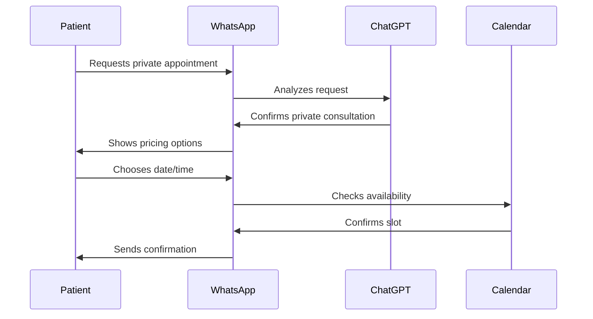
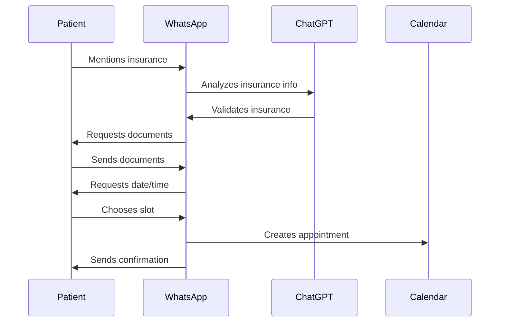

# HealthGPT Technical Specification

## Table of Contents

- [Overview](#overview)
- [System Architecture](#system-architecture)
- [Core Components](#core-components)
- [Integration Points](#integration-points)
- [Data Flow](#data-flow)
- [State Management](#state-management)
- [Technical Requirements](#technical-requirements)
- [Security Considerations](#security-considerations)
- [Testing Strategy](#testing-strategy)

## Overview

HealthGPT is a WhatsApp-based appointment scheduling system for nutritional consultations. The system leverages natural language processing through ChatGPT to understand patient requests and automates the scheduling process through Google Calendar integration.

## System Architecture

The system follows a service-oriented architecture with the following key services:

```
[WhatsApp API] <-> [WhatsApp Service] <-> [ChatGPT Service]
                          |
                    [Calendar Service]
                          |
                   [Google Calendar API]
```

## Core Components

### WhatsApp Service (`whatsapp_service.py`)

- Handles incoming WhatsApp messages
- Manages conversation flow and state
- Processes responses and sends messages
- Integrates with other services

Key features:

- Message processing pipeline
- Conversation state management
- Insurance validation
- Document verification
- Appointment confirmation

### ChatGPT Service (`chatgpt_service.py`)

- Natural language processing with humanized, professional secretary-like responses
- Intent recognition for appointment type (private/insurance)
- Insurance provider validation against accepted list
- Date and time extraction and suggestion
- Context management
- Personalized communication style
- Optimal time slot suggestions based on patient preferences

Key features:

- Professional tone maintenance
- Insurance provider verification
- Document requirement communication
- Time slot optimization
- Appointment confirmation messaging

### Calendar Service (`calendar_service.py`)

- Google Calendar integration
- Availability checking
- Appointment creation
- Event management

### Conversation State Manager (`conversation_state.py`)

- State machine implementation
- Conversation flow control
- Data persistence
- Validation logic

## Integration Points

### WhatsApp Cloud API

- **Version**: v19.0
- **Authentication**: Bearer token
- **Endpoints**:
  - Messages: `https://graph.facebook.com/v19.0/{phone-number-id}/messages`
  - Webhook: Receives incoming messages

### OpenAI ChatGPT API

- **Model**: GPT-3.5-turbo
- **System Messages**: Customized for appointment scheduling
- **Response Format**: Structured for intent recognition

### Google Calendar API

- **Scope**: `https://www.googleapis.com/auth/calendar.events`
- **Authentication**: OAuth 2.0
- **Operations**: Read/Write calendar events

## Data Flow

### Appointment Scheduling Flow

#### Private Consultation



#### Insurance Consultation



## State Management

### Conversation States

- `INITIAL`
- `WAITING_FOR_DATE`
- `WAITING_FOR_TIME`
- `WAITING_FOR_INSURANCE_DOCS`
- `WAITING_FOR_CONFIRMATION`
- `COMPLETED`
- `ERROR`

### State Transitions

```
INITIAL -> WAITING_FOR_DATE (Private)
INITIAL -> WAITING_FOR_INSURANCE_DOCS (Insurance)
WAITING_FOR_INSURANCE_DOCS -> WAITING_FOR_DATE
WAITING_FOR_DATE -> WAITING_FOR_TIME
WAITING_FOR_TIME -> WAITING_FOR_CONFIRMATION
WAITING_FOR_CONFIRMATION -> COMPLETED/ERROR
```

## Technical Requirements

### System Requirements

- Python 3.8+
- FastAPI for API endpoints
- PostgreSQL for data persistence (future implementation)
- Redis for caching (future implementation)

### External Dependencies

- `httpx`: HTTP client
- `python-dotenv`: Environment management
- `pytest`: Testing framework
- `google-auth`: Google authentication
- `openai`: ChatGPT integration

## Security Considerations

### API Security

- All API tokens stored in `.env`
- Webhook verification for WhatsApp
- OAuth 2.0 for Google Calendar
- Rate limiting implementation

### Data Protection

- No PII stored permanently
- Document verification in memory only
- Secure credential management
- HTTPS for all external communications

## Testing Strategy

### Unit Tests

- Service-level testing
- State management validation
- Mock external dependencies

### Integration Tests

- API endpoint testing
- External service integration
- End-to-end flow validation

### Test Coverage

- Minimum 80% coverage required
- Critical paths fully covered
- Error handling scenarios included

## Monitoring and Logging (Future Implementation)

### Metrics to Track

- Message processing time
- External API latency
- Conversation success rate
- Error frequency

### Logging Strategy

- Structured logging
- Error tracking
- Performance monitoring
- User interaction analytics

### Insurance Verification Process

- Validates insurance provider against accepted list
- Requests and verifies insurance card
- Requests and verifies personal ID with photo
- Maintains insurance provider database
- Handles rejection of non-accepted insurance providers

### Calendar Integration Process

- Fetches available slots from Google Calendar
- Suggests optimal times based on:
  - Patient preferences
  - Historical booking patterns
  - Provider availability
- Creates appointments with proper event details
- Sends confirmation with calendar event details
- Handles rescheduling requests
